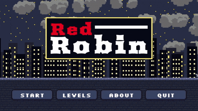
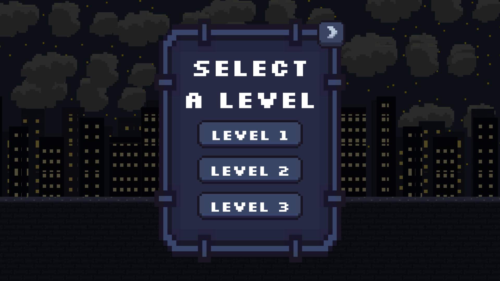
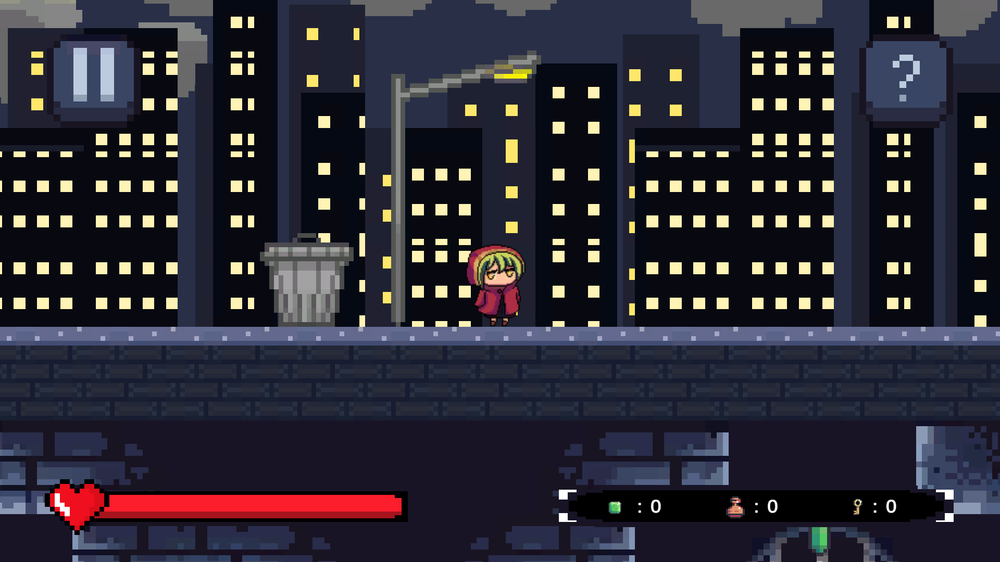
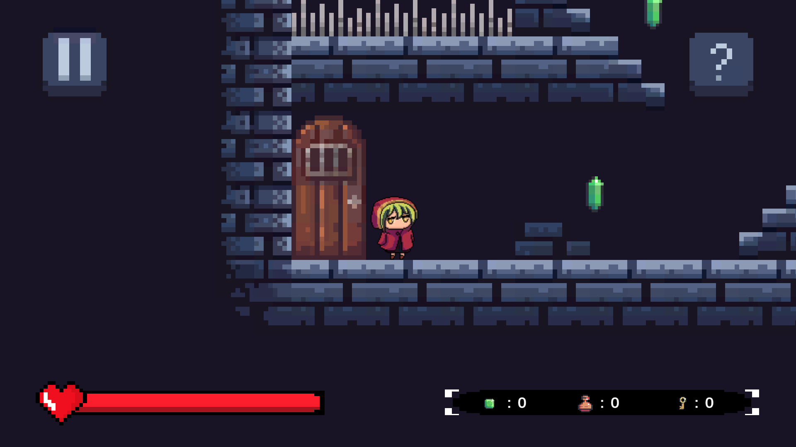
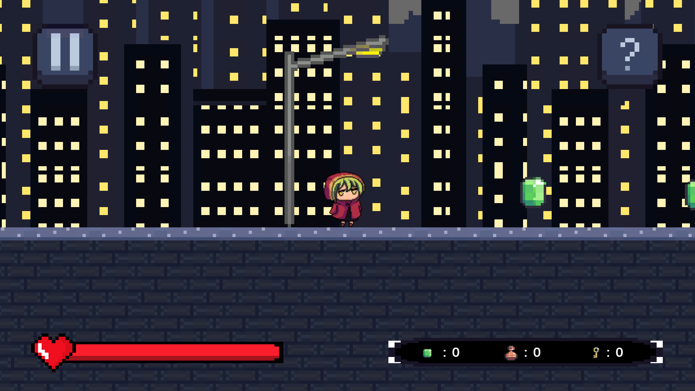
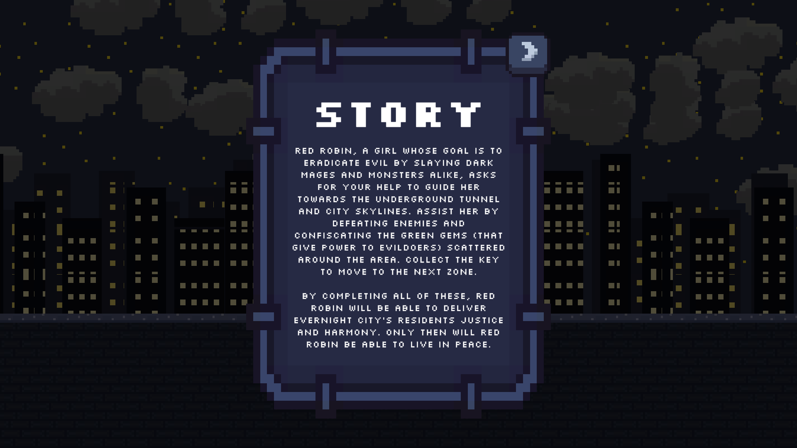

# Red Robin 🎮 (A 2D Platformer Game)

## 📝 Overview
A 2D platformer game focusing on the story of a young girl in red on her way to maintaining justice both underground and overworld. It comprises of three stages with varying levels of difficulty. It acts as an exploration project in the practices of programming and game development.

## 🚀 Gameplay Features
- Interactive map exploration
- Coin collection and health system
- Simple enemy combat and enemy ai player detection
- Moving platforms
- Full gameplay with audio

## 🎥 Gameplay Previews

### Main Menu

### Gameplay

### Level Select

### Level Samples

### Story

## ▶ How to Run

1. Download the `.zip` file from the **Releases** section.  
2. Extract the folder.  
3. Run `RedRobin.exe`.  
4. If Windows flags it as unknown, select **Run anyway**.

## 📦 Credits

Assets used are from free resources (Itch.io, Freesound.org, and various public asset sources).  
Full author list included in:  
📄 **[Credits File](media/credits.txt)**

This project is for learning and non-commercial use.

## 👤 Contribution

All scripting, scene setup, character and enemy animation implementation, gameplay implementation, UI logic, bug fixing, and system integration were done by me.
